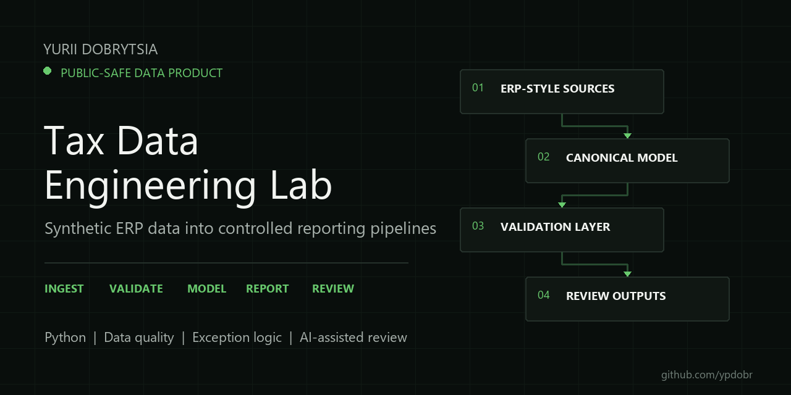

# IC Matrix Pipeline



An end-to-end intercompany transaction matrix on synthetic SAP-style data. Line items go in, a validated entity-by-entity matrix and an exception report come out.

The design principle is the one that matters in tax and audit work: **full-population validation**. Every document is checked against every rule on every run. Sampling hides exactly the errors you are paid to find.

## Quickstart

```bash
pip install -r requirements.txt
python run.py
pytest
```

`run.py` generates the dataset, validates it, quarantines defective documents and writes `output/ic_matrix.xlsx` plus `output/exceptions.csv`.

## Pipeline

```
synthetic SAP-style line items (two legs per IC document)
        |
        v
validation: 5 rules, full population
  R1 missing counterleg      R4 unknown entity
  R2 amount mismatch         R5 duplicate leg
  R3 currency mismatch
        |
        +--> exceptions.csv   (defective documents, with reasons)
        v
clean documents -> FX conversion -> IC matrix (seller x buyer, EUR)
        |
        v
ic_matrix.xlsx
```

## Sample output

```
counterparty            E100        E200         E300        E400  TOTAL_SALES
company
E100                    0.00  2930643.79   3824833.85  3378761.61  10134239.25
E200              6109741.04        0.00   4658772.42  4925239.23  15693752.69
E300               818647.21   837733.42         0.00   942479.83   2598860.46
E400              3716093.92  4378798.22   5411611.68        0.00  13506503.82
TOTAL_PURCHASES  10644482.17  8147175.43  13895217.95  9246480.67  41933356.22
```

Deterministic: same seed, same matrix, every run. `output/exceptions.csv` lists the five quarantined documents with their rule and reason.

## Why the defects are seeded

The generator plants exactly five broken documents, one per validation rule. The test suite asserts each one is caught and that no clean document is flagged. A validator that has never seen a defect is an untested validator.

## Layout

```
src/generate.py   synthetic data, entity master, FX table
src/validate.py   the five rules, quarantine split
src/matrix.py     EUR conversion and the pivot
run.py            one command, end to end
tests/            one test per rule + matrix invariants
```

Synthetic data only. No client data, no real entity names.

MIT License.
