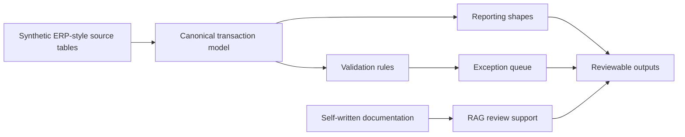

# Tax Data Engineering Lab

Synthetic data engineering lab for tax and finance workflows.

This repository is a synthetic-data lab. It uses invented ERP-style data, generic tax and finance concepts, open-source Python code and self-written documentation.

## Positioning

The lab shows how tax and finance data can move from raw ERP-style tables into controlled review products. The core pattern is simple:

- source ingestion
- canonical data model
- validation rules
- reporting shapes
- exception handling
- documentation
- AI-assisted review

The architecture is reusable and public-safe. It demonstrates the data engineering pattern without copying client, employer or delivery assets.

## Architecture



The first implemented slice creates synthetic invoices and invoice lines, maps them into canonical transactions, checks data quality and produces an intercompany transaction review shape. The same structure can support VAT checks, Intrastat checks and CBAM-style reporting inputs.

## What This Demonstrates

- Data modeling from ERP-style source tables into a reusable transaction layer.
- Validation logic that surfaces missing values, inconsistent mappings and review exceptions.
- A reporting shape that turns normalized transaction data into a reviewable output.
- A public-safe way to discuss tax data engineering without exposing employer or client material.
- A base for future AI-assisted review over self-written documentation.

## Portfolio Signal

This lab is intended to show ownership of a data product, not only tool familiarity:

- source data design
- canonical model design
- validation rules
- exception queues
- reporting outputs
- monitoring manifests
- governance boundaries
- AI-assisted review design

## Safe Scope

Allowed:

- synthetic ERP-style tables
- public regulatory concepts
- generic validation examples
- open-source Python code
- local RAG experiments over self-written documentation
- architecture diagrams written from first principles

Excluded:

- client names
- real transaction data
- Deloitte templates or code
- project screenshots
- copied Alteryx workflows
- copied XML/reporting packages
- proprietary mapping logic
- internal terminology that identifies a client or delivery asset

## Planned Modules

1. ERP ingestion layer
2. Canonical tax and finance data model
3. Validation rule engine
4. Reporting-shape builder
5. AI-assisted review layer
6. Documentation and handover pack

## Current Status

Synthetic ERP source layer, canonical transaction model, validation exception queue, intercompany review shape and local pipeline runner added.

Verified local run:

```text
bronze invoices: 50
bronze invoice lines: 126
silver canonical transactions: 126
silver validation exceptions: 20
gold intercompany review rows: 24
```

## Verification

Run the tests (pytest picks up `pythonpath = ["src"]` from `pyproject.toml`, so no extra setup is needed):

```bash
python -m pytest
```

Run the pipeline (module runs need `src` on the import path):

```bash
PYTHONPATH=src python -m tax_data_lab.run_pipeline --base-dir data/pipeline_run --transactions 500 --seed 42
```

Publication check:

```text
The repository contains synthetic data and generic architecture only. Public safety notes are tracked in docs/governance.
```

## Generate Synthetic ERP Data

```bash
python -m tax_data_lab.data_generation.generate_synthetic_erp --output-dir data/synthetic_erp --transactions 250
```

The generated CSV files stay in `data/`, which is ignored by Git.

## Build Canonical Transactions

```bash
python -m tax_data_lab.canonical_model --input-dir data/synthetic_erp --output-dir data/processed
```

This writes:

- `canonical_transactions.csv`
- `validation_exceptions.csv`

## Build Reporting Shapes

```bash
python -m tax_data_lab.reporting_shapes --canonical-file data/processed/canonical_transactions.csv --output-dir data/reporting
```

This writes:

- `intercompany_transaction_review.csv`

## Run Full Local Pipeline

```bash
python -m tax_data_lab.run_pipeline --base-dir data/pipeline_run --transactions 500 --seed 42
```

This writes bronze-style source files, silver-style processed files, a gold-style reporting shape and a monitoring manifest with row counts.

## Roadmap

1. Add DuckDB-backed local storage for larger synthetic runs.
2. Add VAT and Intrastat validation shapes.
3. Add a CBAM-style input preparation module with synthetic supplier and product data.
4. Add RAG over self-written documentation for review support.
5. Add a compact dashboard or report view for exceptions and output checks.
